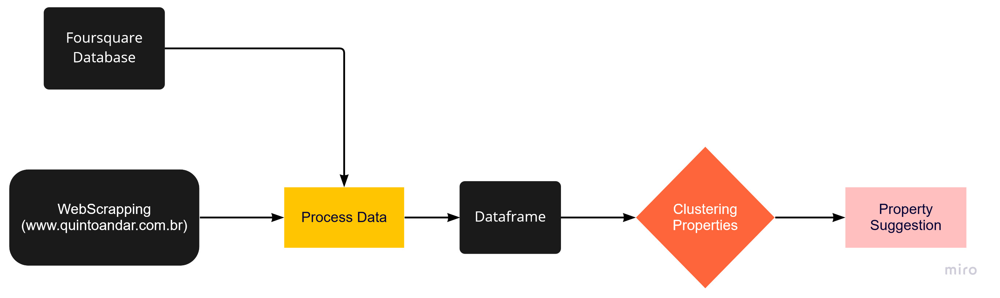

<h1 align="center"> Realtor </h1>

## Objective of this project : 
**Given an input, the algorithm provides the apartments/houses that best match the customer's choice.**

## How was it built?
* The first step was data collection;  
(Property data were collected through a crawler from the www.quintoandar.com.br)  
The web scrapping code is in this notebook :  
[Scrapping quintoandar.com.br](code/scrapping_quintoAndar.ipynb)  

* The second step was process data; 
(The processing of the data was carried out so that a dataset could be obtained in an easy-to-analyse format, as the data coming from the crawler was in .json format) 
The process data code is in this notebook :  
[Processing data from quintoandar.com.br](code/process_data.ipynb)  

* The third step was analyzing data; 
(The analysis aims to suggest properties for rent according to the user's preference, given their preference, properties are suggested in downtown São Paulo that meet these criteria, through data from the fifth floor website and data from the api of the website of the foursquare) 
The data analysis code is in this notebook:  
[Data analysis from quintoandar.com.br and Foursquare API](code/analyzing_data.ipynb)  

## Flowchart

  

## How to use this project ?
* To use the codes in this project, you need a python venv.  
The repository can be cloned using **git clone https://github.com/NophaieViscente/quintoAndar**, done that the necessary libraries can be installed using the command:  
**pip install -r requirements.txt**

## To use with conda, use this command
**conda create --name <your_env_name> --file requirements.txt**